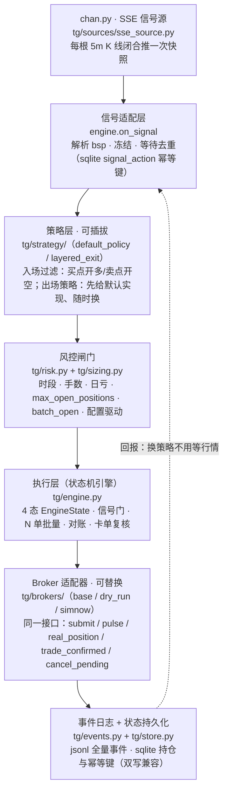

# SimNow 自动下单 · 交易网关分层架构与功能总结

> 版本：v1.0（2026-09-05） · 基于 custom-dev 分支（Phase G 已合入）
> 用途：专家评审材料。对照《SimNow自动下单，交易网关分层架构.png》绘制时的设计，逐层落地情况 + 交易语义全量说明。
> 代码位置：`chan.py/trader_gateway/`（GitHub: jbxenzxy/chan.py, branch `custom-dev`）

---

## 一、分层架构总览



与原架构图（PNG）的差异：原图 6 层不变；落地后**执行层**长出了三块原图未画的子结构——①4 态状态机 + 信号门，②多仓 PositionBook（N 单批量），③对账/卡单复核闭环（Phase E/F/G）。**Broker 接口**也从单一 `submit` 扩展为 5 个方法（详见 §三.5）。

---

## 二、模块清单（layer → file → 职责）

| 层 | 文件 | 职责 | 关键入口 |
|---|---|---|---|
| 信号源 | `tg/sources/sse_source.py` | 订阅 chan.py SSE，每根 K 线闭合推快照 | `push_bar` → engine.on_bar |
| | `tg/sources/replay_source.py` | 历史回放（测试/复现用） | — |
| 策略层 | `tg/strategy/default_policy.py` | 买点开多/卖点开空的入场过滤 | 可插拔，替换不动引擎 |
| | `tg/strategy/layered_exit.py` | 分层出场（止盈/止损/时间），先给默认实现 | `exit_plan` 挂在 Position 上 |
| 风控 | `tg/risk.py` | 时段/手数/日亏闸门，`check_open` | `risk.max_open_positions`（默认 1） |
| | `tg/sizing.py` | 单笔手数 + 批量手数 | `sizing.batch_open`（默认 1） |
| 执行 | `tg/engine.py` | 4 态状态机、信号门、N 单开/平、对账、卡单复核 | `on_bar` / `on_signal` |
| | `tg/position_book.py` | 多仓容器（同向多笔、FIFO、持久化双写） | `same_side_positions` / `has_opposite` |
| Broker | `tg/brokers/base.py` | 抽象接口 + OrderIntent/Offset 映射 | `submit` 等 5 方法 |
| | `tg/brokers/dry_run.py` | 同步撮合（回归测试基线） | — |
| | `tg/brokers/simnow.py` | TqSdk/SimNow：超价限价、平仓追价、成交判定 | `_submit_open` / `_submit_close` |
| 基础设施 | `tg/events.py` | jsonl 全量事件（审计/复盘唯一真相） | `ev.write(kind, **kv)` |
| | `tg/store.py` | sqlite：持仓快照、signal_action 幂等键、day_stats | 双写新旧格式，零迁移 |
| | `tg/config.py` | 全部配置项（含默认值） | `GatewayConfig` |

---

## 三、关键设计

### 1. 四态状态机与信号门（交易串行化）

```
IDLE ──开仓/解锁──▶ IN_TRADE ──全部离场──▶ IDLE
  │                    │
  └── OPENING（开仓中）  └── EXITING（离场中）
```

- **一次只跑一笔"交易"**：`IN_TRADE` 期间所有新信号被信号门拦截——同向信号直接 skip（事件 `signal_skip / in_trade_multi_same_side`），**反向信号仅触发离场、绝不反向入场**（单仓 `close_only`；多仓含反向走 FIFO 全平）。"N 单全部离场后 state 才回 IDLE"，此时才允许下一次交易。
- 这一条保证了用户规格里的"已有运行中的单子再开新单会混乱"在结构上不可能发生——不是靠策略判断，而是状态机硬约束。

### 2. 入场两种方式（由账户状态自动决定）

| 条件 | 入场方式 | 报文 | 说明 |
|---|---|---|---|
| 账户无仓 | **开仓 OPEN** | offset=Open | 常规入场 |
| 账户有前一日的反向锁仓单 | **解锁 UNLOCK** | offset=CloseYesterday | 平掉反向昨仓（避开平今高费率）。E2 设计决策：**解锁只平昨仓、不开新今仓**，今仓方向由下一个信号决定 |

### 3. 一次入场 N 单（N≥1）

- `sizing.batch_open`：仓位管理关闭时默认 1；开启时配置为 N≥1，同根 K 线同一信号一次连开 N 笔（`_open_positions` 循环，受 `risk.max_open_positions` 上限截断并写 warning）。
- 每笔是独立 Position（`tg/position_book.py`），离场按 FIFO（entry_bar_seq 升序）逐笔处理，支持部分平仓。

### 4. 入场方式决定离场方式（硬规则，无配置开关）

```python
# engine._exit_intent —— 数学约束（手续费最优），不是策略选择
OPEN_FIRST   → LOCK_SOFT   → OrderIntent.LOCK   # 开反向同手数（平今太贵 → 锁仓替代平今）
UNLOCK_FIRST → CLOSE_HARD  → OrderIntent.CLOSE  # 平昨，无高昂平今费 → 直接平仓
```

离场**条件**有三种（止盈 / 止损 / 时间 EOD）+ 第四种（反向买卖点信号）；离场**方式**一律由入场方式联动推导，外部不可覆写。

### 5. Broker 接口（5 方法，可替换）

| 方法 | 语义 | dry_run | simnow |
|---|---|---|---|
| `submit(intent, side, vol, price, signal_key)` | 报单（同步返回最终态 Order） | 同步撮合 | 超价限价；开仓单次、平仓追价循环 |
| `pulse()` | 心跳/连接保活 | no-op | wait_update 驱动（主线程独占） |
| `real_position(side)` | 查真实持仓（对账依据） | None | get_position |
| `trade_confirmed(intent, signal_key)` | **权威成交复核**：按 signal_key→raw_order_id 索引重新 `get_order`，累计 `order.trade_records[*].volume ≥ 委托量` | True（同步撮合即确认） | 查 CTP 成交回报明细（唯一可信依据） |
| `cancel_pending(signal_key)` | 撤掉该信号全部在途单 | 0（无挂单） | cancel_order + wait_update 同步回报 |

### 6. 报单与卡单处理（当前实现精确语义）

**入场（OPEN）**：单次超价限价（对手价 ± overprice_points，主动跨价差确保成交）→ `fill_timeout_open`（config 默认 **5 秒**）内未成交**自动撤单** → 记 rejected，**不追单**，引擎无幻影持仓，等下一个信号。语义 = "入场没成功，最多不赚钱，但不会亏钱"。

**解锁（UNLOCK）**：2026-09-05 规格拍板后**与 OPEN 完全归一**——解锁≈开仓（入场语义），单次超价 + `fill_timeout_open`（5s）超时撤单、**不追价**；报文仍是 CloseYesterday（平反向昨仓，避开平今费率）。保留 close 类的 `_wait_position_ok` 前置守卫（提交前检查，非追价）。通道级异常兜底由 Phase F1 接管（见下）。

**离场（CLOSE/LOCK）**：`_submit_close` 追价循环——每轮取最新对手价 ± overprice 重定价（盘口怎么走挂价就跟到哪），每轮 5s 未成交**先撤单再追**，最多 20 轮；追价用尽（如涨跌停锁死）才放弃，交引擎对账兜底。拒单后引擎进入 `_close_retry_bars`=5 根 K 线冷却，之后**自动重试平仓**。语义 = "离场不及时浮盈变亏损，所以撤单 + 追单"。

**卡单复核闭环（Phase F/G，防通道级异常）**：
- F1：UNLOCK 报单后记 `_unlock_in_flight`（**持久化到 sqlite，引擎重启不丢**）；5 根 bar 后 `broker.trade_confirmed` 用 CTP 成交回报复核——确认成 → 清标记；未确认 → 先 `cancel_pending` 撤在途单（G2，防"重建持仓后挂单又成交"的双重平仓），再查 `real_position`：真实仍有仓 → 用快照重建 portfolio；真实已平 → 写恢复事件。
- F2：引擎重启 `_restore` 末尾首拉 `real_position` 对账（防"本地有仓、真实已平"的幽灵持仓），告警不接管、不阻断启动。
- 周期对账：每根 bar 引擎拿本地 portfolio 与 `real_position` 比对，差异按 FIFO 部分平/清侧/告警（不主动改状态机）。

---

## 四、持久化与事件审计

- **sqlite（store.py）**：positions（多仓新格式 + 单仓旧格式**双写**，老库零迁移）、`signal_action`（信号幂等键，防重复触发）、`_unlock_in_flight`、day_stats、bars_seen。重启 `_restore` 全量恢复，真实持仓多/少时由对账链修正。
- **jsonl（events.py）**：每个决策点全量落事件——order / order_rejected / trade / signal_skip / position_mismatch / unlock_stuck_* / restore_reconcile_failed 等，任何一笔"为什么没成"都可追溯。

## 五、功能规格对照表（逐条核对结论）

| # | 规格要求 | 状态 | 实现位置 |
|---|---|---|---|
| 1 | 无仓 → 开仓入场 | ✅ | engine.on_signal IDLE 分支 |
| 2 | 有前日锁仓单 → 解锁入场 | ✅ | E2：IDLE + has_opposite → `_unlock_position`（CloseYesterday） |
| 3 | 一次入场 N 单，N 全离场后才下一次交易；仓位管理关 N=1 / 开 N≥1 | ✅ | sizing.batch_open（默认 1）+ 4 态状态机（IN_TRADE 持续到 portfolio 空） |
| 4 | 运行中忽略新信号 | ✅ | 信号门：IN_TRADE 同向 skip |
| 5 | 反向信号仅触发离场、不反向入场 | ✅ | IN_TRADE 反向 → close_only / FIFO 全平，无反手 |
| 6 | 入场方式决定离场方式（开→锁 / 解锁→平） | ✅ | Phase D `_exit_intent` 硬规则，无配置开关 |
| 7 | 离场条件：止盈/止损/时间 或 反向信号 | ✅ | layered_exit（exit_plan）+ on_signal 反向分支 |
| 8 | 入场卡单：等 5s → 撤单 → **不追单**，等新信号 | ✅（OPEN 与 UNLOCK 已归一） | 两者共用 `fill_timeout_open`（config 默认 5s）超时撤单即放弃 |
| 9 | 离场卡单：等 5s → 撤单 + **追单** | ✅ | `_submit_close` 20 轮 × 5s 撤单重报追价 + 引擎 5-bar 冷却重试 |
| 10 | 卡单复核防通道异常（真实成交以 CTP 回报为准） | ✅ | Phase F/G：trade_confirmed + in_flight 持久化 + cancel_pending + 首拉对账 |

### 差异点处理结果（2026-09-05 用户拍板后已实施）

- ~~**差异 A —— UNLOCK 的卡单策略**~~ ✅ **已修复**：UNLOCK 原走平仓路径带 20 轮追价，与"入场不追单"规格不符。拍板"解锁≈开仓，与 OPEN 归一处理"后，UNLOCK 改走独立单次路径（`_submit_unlock`）：单次超价 + `fill_timeout_open`（5s）超时撤单、不追价；报文仍为 CloseYesterday。P17 新增 [6] 段 12 例验证。
- ~~**差异 B —— 时间单位**~~ ✅ **随 A 归一解决（主路径）**：审计更正——`fill_timeout_open` 的实际生效默认是 **config.py 的 5.0s**（此前只看 simnow.py 的 10.0 兜底属误读）；OPEN/UNLOCK 入场超时 = 离场每轮 = 5s，与规格一致。唯一保留 bar 粒度的是 Phase F1 的 UNLOCK 复核窗口（5 根 bar）——它是**通道级异常兜底**（撤单失败/回报漂移才触发，如断线重连），不是"等 5s 撤单"的主机制，用 bar 粒度可避免行情噪音反复触发，予以保留。

### 实施中发现的既有 bug（顺带修复，2026-09-05）

- **平仓方向错误**：旧 `_submit_close` 对 close 类报文直接用 `_DIRECTION[side]`——平多（side=LONG）会发 `direction=BUY`（CTP 语义为平空/开多），真实下单必被拒或平错方向。同函数内定价逻辑（`_is_buy("close", LONG)=False`，走 bid）与方向字段自相矛盾。因 dry_run 撮合不校验 direction 字符串、且无测试断言过 insert 方向，回归从未暴露。已修复为 `_CLOSE_DIRECTION`（平多=SELL / 平空=BUY），P17 [6] 断言 direction。

## 六、测试矩阵

| 套件 | 覆盖 | 例数 |
|---|---|---|
| P5–P8 | 报价归一 / 权威成交判定 / 对手价定价 / 分层出场 | 69 |
| P9 | sizing（单笔+批量） | 62 |
| P10 | 四态状态机 + 信号门硬约束 | 59 |
| P11 | OrderIntent → CTP Offset 报文映射 | 59 |
| P12–P14a | PositionBook 多仓 + 配置化上限 | 206 |
| P15a/b | N 单批量开 + FIFO 多仓平/对账 | 195 |
| P16 | Phase F：卡单复核 + in_flight 持久化 + 首拉对账 | 65 |
| P17 | Phase G：真实成交复核 + 撤在途单 + UNLOCK 归一 OPEN + 平仓方向修复 | 42 |
| **合计** | **全套回归（dry_run 基线，可重复）** | **753 全绿** |

另附 `tests/smoke_simnow_phase_g.py`：SimNow 交易时段只读冒烟（连接/真实持仓/成交复核/撤单接口），`--trade` 才做 1 手真开平。

## 七、已知风险与边界

1. SimNow 不支持市价单 → 全限价 + 超价/追价模拟市价行为；涨跌停锁死时追价 20 轮用尽后放弃，靠对账链兜底。
2. `wait_update` 非线程安全 → SimNow broker 所有 api 调用约束在主线程，成交判定只信 `order.trade_records`（持仓缓存仅作诊断信号）。
3. LOCK（软离场）在引擎视角记为离场结算；broker 端真实多出的反向锁仓由后续 UNLOCK 或人工处理——这是"锁仓替代平今"方案的固有边界，评审时值得重点讨论。
4. UNLOCK 复核窗口（5 bars）内若行情剧烈波动，重建 portfolio 用的是提交时快照价格，浮盈计算有偏差（不影响仓位正确性）。

## 八、演进史（Phase A–G）

| Phase | 内容 | 状态 |
|---|---|---|
| A/B | 4 枚举 + 4 态状态机 + 信号门 | ✅ |
| C/D | OrderIntent→Offset 报文 + entry_mode→exit_mode 硬规则 | ✅ |
| E1–E3.3 | PositionBook 多仓 + 配置化上限 + N 单批量 + FIFO 平仓/对账 | ✅ |
| F | 卡单复核（UNLOCK 5-bar 复核 + in_flight 持久化 + 重启首拉对账） | ✅ |
| G | SimNow 真实成交复核（trade_records 权威判定）+ 撤在途单防双重平仓 | ✅ |
| G+（2026-09-05 下午） | UNLOCK 归一 OPEN（单次+5s 超时撤单不追价）+ 平仓方向既有 bug 修复 | ✅ |
