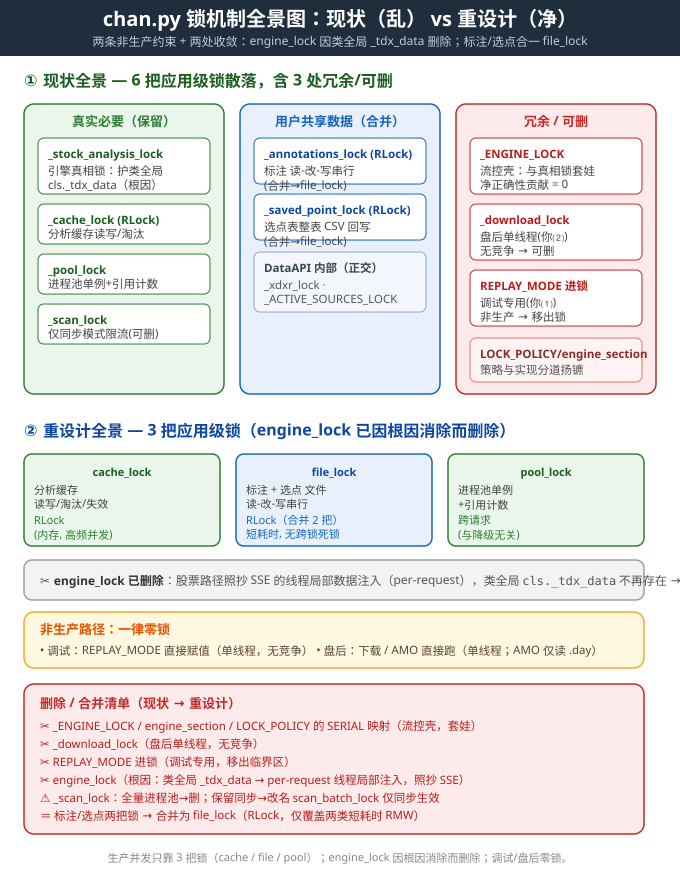

# chan.py 锁机制全景图与重新设计（v4 · 叠加两条非生产约束 + 两处进一步收敛）

> 结论先行：**当前代码的“锁”确实偏乱**——6 把应用级锁里，真正为“正确性”必须的原本只有 3 把，外加标注/选点 2 把用户共享数据、1 把 `_scan_lock` 仅限流；另有 `_ENGINE_LOCK`（流控壳）、`_download_lock`（盘后单线程）、`REPLAY_MODE` 进锁（调试专用）三处冗余。
>
> 经过两轮收敛后，重新设计只需 **3 把应用级锁**（`cache_lock` / `file_lock` / `pool_lock`）：
> - **`engine_lock` 可以彻底删掉** —— 它的唯一根因是股票路径用了「类全局 `CTdxAPI._tdx_data`」，而期货/SSE 路径早已用「线程局部注入」免锁，照抄即可。
> - **`annotations_lock` + `saved_point_lock` 合并为一把 `file_lock`** —— 二者都是短耗时用户数据文件读-改-写，合并更简单、还能消掉跨锁顺序死锁风险。
>
> 调试与盘后路径一律零锁。

---

## 一、现状锁全景（已逐行核实，含 verdict）

| # | 锁 | 位置 | 护的共享资源 | 性质 | 结论 |
|---|----|------|--------------|------|------|
| 1 | `_stock_analysis_lock` | AppEngine.py:265（临界区 :632） | CChan 构建 + `cls._tdx_data`（CTdxAPI.set_data 写**类变量**） | 引擎真相锁 | ✅ **根因锁**；重构数据注入后可删（见 §2.1①） |
| 2 | `_cache_lock` (RLock) | AppData.py:1243（AppEngine.py:259 别名） | 分析缓存 stocks_analysis_cache 等读写/淘汰/失效 | 高频并发 | ✅ **保留**（改名 `cache_lock`，语义不变） |
| 3 | `_annotations_lock` (RLock) | AppData.py:1263 | 标注 读-改-写 串行（多请求并发安全） | 用户共享文件 | ✅ **合并进 `file_lock`** |
| 4 | `_saved_point_lock` (RLock) | AppData.py:1266 | 选点表 整表 CSV 回写（防并发丢更新） | 用户共享文件 | ✅ **合并进 `file_lock`** |
| 5 | `_pool_lock` | AppScanPool.py:62（:93/:326/:346/:361） | 进程池单例 `_pool`/`_pool_engine` + 引用计数 `_active_scans` | 单例生命周期 | ✅ **保留**（与是否降级线程池无关） |
| 6 | `_scan_lock` | AppScan.py:53（:408 临界区） | 同步扫描批次串行（防内存峰值） | 限流壳 | ⚠️ 仅同步模式有意义；进程池模式下对正确性冗余 → 降级/删除 |
| 7 | `_ENGINE_LOCK` + `engine_section` | AppChart.py:45/:58（LOCK_POLICY 驱动） | 名义“引擎串行”，但真正串行在 #1 临界区 | 流控壳 | ❌ **删除**（净正确性贡献 = 0，与 #1 重复套娃） |
| 8 | `_download_lock` | ~~ElTdxAPI.py:80~~ | ~~下载状态/任务~~ | ~~下载并发~~ | ✅ **已随盘后下载功能移除**（ElTdxAPI.py / AppDownload.py 已删，锁随之消失） |
| 9 | `REPLAY_MODE` 进锁 | 写于 AppEngine.py:638/644/740（在 #1 临界区内） | CMyBSPointList.REPLAY_MODE（类级调试标志） | 调试专用 | ❌ **移出锁**（仅调试用，非生产，无竞争） |
| — | `_xdxr_lock` | TdxAPI.py:702 | 除权数据缓存 | DataAPI 内部 | ✅ 保留（正交） |
| — | `_ACTIVE_SOURCES_LOCK` / 实例 `_lock`/`_close_lock` | TqSdkCSSESource.py:63/210/216 | TqSdk 数据源单例注册表 / 实例关闭 | DataAPI 内部 | ✅ 保留（正交） |

### 关键对照：股票路径有锁、期货/SSE 路径无锁，为什么？
- **股票路径**：`CTdxAPI.set_data()` 是 **classmethod 写类变量 `CTdxAPI._tdx_data`**（TdxAPI.py:1319/1332），`CChan(data_src="custom:TdxAPI.CTdxAPI")` 内部实例化 `CTdxAPI` 并读 `cls._tdx_data`（:1366-1373）。数据流经**进程级类全局**，并发会互相覆盖 → 必须 `engine_lock` 串行。
- **期货/SSE 路径**：`_build_futures_chan` 用 `src.set_data(...)` + `with session_context(src): CChan(...)`，**线程局部绑定本会话缓存**，注释明写“set_data 写入与 get_kl_data 读取同源”，且**这条路径根本不取 engine_lock** —— 它已经是免锁的活样本。

> 这一对照直接回答了「engine_lock 能否省」：**能**，因为 engine_lock 的唯一根因就是那个类全局 `_tdx_data`；把它改成 per-request 注入（照抄 SSE），根因消失，锁自然多余。

---

## 二、重新设计（抛开现有代码，从原则出发）

### 设计原则
1. **一把锁只护一种共享可变状态，锁名即资源名**（杜绝“流控壳”“限流壳”）。
2. **只在“生产并发路径”加锁**；非生产（调试 / 盘后）天然单线程，不加锁。
3. **先消除“进程级共享可变状态”这个根因，再谈锁**：能靠 per-request 隔离解决的，不要靠锁串行解决。
4. **用户共享数据（标注 / 选点）用一把统一文件锁**；二者都是短耗时 RMW，合并更安全也更简单。
5. **进程池单例跨请求共享**，其创建/销毁/引用计数必须独立 `pool_lock`，与引擎是否降级无关。

### 重设计后的锁集合（3 把应用级 + DataAPI 内部，互不纠缠）

| 新锁名 | 类型 | 护的共享资源 | 持锁入口 | 非生产? |
|--------|------|--------------|----------|---------|
| `cache_lock` | RLock | AppData 全部分析缓存（读写/淘汰/失效） | 缓存读、写、cleanup | 否 |
| `file_lock` | RLock | 用户数据文件读-改-写：**标注 + 选点表**（合并自 `_annotations_lock`/`_saved_point_lock`） | 标注增删改查 / 选点增删改 | 否 |
| `pool_lock` | Lock | 进程池单例 + 引用计数 | `_get_pool` / `destroy_pool` | 否 |
| （DataAPI 内部）`_xdxr_lock` | Lock | 除权缓存 | TdxAPI 内部 | 不改 |
| （DataAPI 内部）`_ACTIVE_SOURCES_LOCK` | Lock | TqSdk 数据源注册表 | TqSdkCSSESource | 不改 |
| （DataAPI 内部）源实例 `_lock`/`_close_lock` | Lock | 单数据源状态/关闭 | TqSdkCSSESource | 不改 |

> **`engine_lock` 不在表中**：它不是“必要的锁”，而是“类全局 `_tdx_data` 这个坏设计的补丁”。消除根因后即删（见 §2.1①）。

### 2.1 两处进一步收敛（第六轮问答）

#### ① `cls._tdx_data` 放到对象/线程局部中 → `engine_lock` 可省 ✅
- **根因**：`engine_lock` 只保护一件事——`CTdxAPI._tdx_data` 这个**类全局变量**在“set_data 写入”与“CChan 读取”之间不被并发覆盖。
- **做法（照抄 SSE 已验证模式）**：不再用 `CTdxAPI.set_data(cls, data)` 写类变量，改为**每请求线程局部/实例绑定**数据源。具体：给股票路径引入与 SSE 相同的 `session_context(src)` 机制，`CChan(data_src="custom:TdxAPI.CTdxAPI")` 内部经线程局部取到本请求的数据，而非读 `cls._tdx_data`。
  - 双窗路径当前是「先 set_data(sub)→建子 chan→再 set_data(main)→建主 chan」，改用 `with session_context(sub_src):` / `with session_context(main_src):` 两个独立作用域即可，互不污染。
- **结果**：数据全程 per-request，无进程级共享写 → CChan 构建即天然线程安全 → **`engine_lock` 删除**。期货/SSE 路径已如此运行且无锁，证明内核在分析中不写其它进程级可变状态（否则 SSE 也需锁），故无遗漏。
- **兜底**：若未来确认内核在分析中仍写其它进程全局（极少见），再为那一个状态单独加最小锁；不要为防万一而保留 engine_lock。

#### ② 标注 + 选点 合并为一把 `file_lock` ✅
- **理由**：二者都是「用户数据文件 读-改-写」短耗时操作（标注增量更新、选点整表 CSV 回写），且都属于同一类资源（用户持久化数据）。合并后：
  - 锁数量 -1，心智负担更低；
  - **消除跨锁顺序死锁风险**——若两把锁分别存在，某路径「标注写→cache」、另一路径「cache→选点写」顺序不一致即可能死锁；合并为一把后不可能自锁；
  - 因操作短（毫秒级文件 RMW），“标注写阻塞选点写”的代价可忽略。
- **命名建议**：叫 `file_lock` 略宽（易诱使后续把“长耗时导出”也塞进来，反而拖累标注/选点）。更精确可叫 `user_store_lock` 并在注释写明「仅覆盖标注与选点两类短耗时 RMW」。本设计用 `file_lock` 并显式限定作用域。
- **类型**：保持 RLock（ handlers 内可能嵌套写）。

### 请求流 × 锁 全景（重设计后）
```
生产路径（多线程，需锁）:
  /api/analysis ─┐
  /api/*select ───┼─► [per-request 线程局部数据注入，无 engine_lock] ─► CChan + cls._tdx_data(已实例/局部化)
  scan_one(同步) ─┘                                                  └─[cache_lock]► 读写分析缓存
  AMO(盘后) ─────► 只读 .day 文件 + 算统计 ───────────────────────► 无锁

  /api/annotation/* ─► [file_lock] ─► 标注文件
  /api/saved_point/* ─► [file_lock] ─► 选点 CSV

  submit_batch_scan ─► [_get_pool] ─[pool_lock]─► 进程池单例
                       worker.scan_one ──[per-request 注入]─► CChan

非生产路径（单线程，无锁）:
  调试 REPLAY_MODE ─► 直接赋值（无锁）
  （盘后下载已移除，其 _download_lock 随之消失）
```

---

## 三、改造路线图（从现状到重设计）

1. **消除 engine_lock 根因（关键）**
   - 给股票路径引入与 SSE 相同的 `session_context` 线程局部数据源绑定；`CTdxAPI` 去掉类变量 `_tdx_data` 与 `set_data` classmethod（或改为线程局部）。
   - `AppEngine._analyze_stock_internal` 改为 `with session_context(src): CChan(...)` 模式，删除 `with _stock_analysis_lock:`。
   - `REPLAY_MODE` 三处写入（:638/:644/:740）移出临界区，改为普通赋值（调试专用）。
   - 删除 `AppEngine._stock_analysis_lock` 定义。

2. **删除流控壳**
   - 删除 `AppChart._ENGINE_LOCK` 与 `engine_section`；删除 `AppOrch.LOCK_POLICY` 中 SERIAL→`_ENGINE_LOCK` 映射（或仅留文档注释）。
   - `AppAMO.call_amo` 移除 `engine_section("call_amo")`（AMO 不进引擎，只读 .day）。
   - 同步更新 `test_phase3_guards.py`、`func_map_check.py` 守护断言。

3. **删除下载锁** ✅（已随盘后下载功能移除；`ElTdxAPI.py`、`AppDownload.py` 均已删除）

4. **合并文件锁**
   - 新增 `file_lock = threading.RLock()`（置于 AppData，与 `_cache_lock` 同级）。
   - `_annotations_lock` / `_saved_point_lock` 全部替换为 `file_lock`；统一注释「仅覆盖标注与选点短耗时 RMW」。

5. **缓存 / 进程池锁**
   - `cache_lock`、`pool_lock` 原样保留（仅 `engine_lock` 改名/删除不影响它们）。

6. **`_scan_lock` 处置（二选一）**
   - 方案 A（全量进程池）：删除 `_scan_lock`，同步 `scan_one` 串行由 per-request 注入天然保证。
   - 方案 B（保留同步兼容）：改名 `scan_batch_lock`，仅 `SCAN` 同步模式取锁做批次限流；`SCAN_ASYNC` 进程池模式不取。

---

## 四、一句话总结

> **现状乱在“一把真锁（engine_lock）藏在流控壳（_ENGINE_LOCK）后面、还顺手锁了调试标志、又给盘后单线程加了下载锁，且标注/选点各用一把锁”。** 重新设计后：**生产并发只靠 3 把分工明确的锁**（`cache_lock` 内存缓存 / `file_lock` 用户文件 / `pool_lock` 进程池），`engine_lock` 因消除类全局 `_tdx_data`（照抄 SSE 线程局部注入）而彻底删除，调试与盘后零锁，策略与实现重新对齐。

---

## 附：锁机制全景图（现状 vs 重设计）

> 全景图见下图，引用同目录 `chan_lock_panorama_r2.svg`。下载整个 Docs 文件夹即可正常显示；若需**单文件分发**（图片内嵌、不依赖外部 .svg），请看同目录 `chan_lock_redesign_selfcontained.md`。


