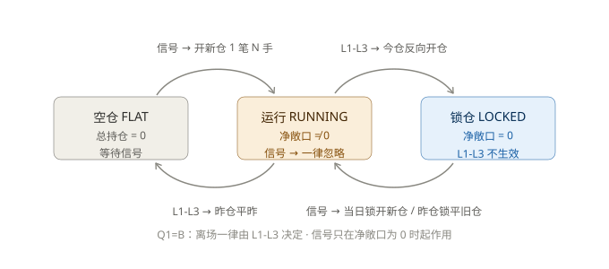
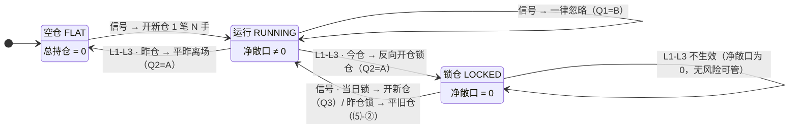

# 自动下单 · 账户状态机核对与改造方案 v1.2

> 定位：① 对你（用户）口述的「空仓 / 锁仓 / 运行」三态规则做**逐条代码核对**；
> ② 记录核对出的差异与风险；③ 给出改造建议与优先级；④ 作为后续迭代的**交接文档**。
>
> 基线：`custom-dev` 分支 HEAD（2026-09-09，页面首条 commit `4c3ca9c`）。
> 已把远端 tarball 解到 `sandbox/ext/chan.py-custom-dev` 与本地 `C:\my_chan_project` 逐文件比对：
> **Trading/ 目录（含 Engine / Broker / Strategy / Infra / Config）内容与远端完全一致**（仅 CRLF 行尾差异）。
> 因此本文所有代码引用以本地文件为准，且等价于"最新代码"。
>
> 本轮**未修改任何代码**。

> **v1.1 修订（2026-09-09，用户补充口径后复核）**
> 1. 新增下方「术语约定」：明确 **笔 / 手 / 锁 / 层** 四个单位，锁定"A、B、C、D 各 = 1 笔 = N 手（N=2）"的口径；
>    **核对结论全部不变**（v1.0 的推导本就按此口径）。
> 2. **修正 §5 S8 的保证金测算错误**：v1.0 把"1 锁 = 4 手"的保证金写成 115 万（实为 2 锁的量），
>    正确值 **1 锁 ≈ 57.6 万、2 锁 ≈ 115 万**（见 §4 S8）。
> 3. **拆分 D2 为 D2a / D2b**：开仓路径（无 try，会崩 + 不锁仓）与 LOCK 落簿路径（有 try，**静默丢腿**）后果不同，
>    并注明 D2a 当前被 D1 掩盖、修好 D1 后必然踩到。
> 4. §2 的 2 锁例子补上"取与信号反向的最早一笔"，并写明 **4 笔需要 4 个信号**。

> **v1.2 修订（2026-09-09，Q1–Q6 拍板后）**
> 1. §5 由"待拍板问题"改为 **决策记录**：Q1=B、Q2=A、Q3=空仓/锁仓可开新仓、Q4=B、Q5=取消 `max_lock_layers`
>    （改为工程性的 `max_book_legs`）、Q6=**会计锚与风控锚分离**（`ExitPlan.params["risk_anchor"]`）。
> 2. **Q5 采纳用户意见**：`max_lock_layers` 作为"策略变量"确实不必要，已从方案删除；
>    保留的是**容器/资金硬约束** —— `risk.max_book_legs`（总腿数上限），理由写入 §5-Q5。
> 3. **Q6 纠正 v1.1 的一处隐患**：v1.1 的 S3 写的是"entry_price 用 A 的解锁成交价重设" ——
>    **这会丢掉 (P₂−P₀)×N 的已实现盈亏、导致对账 mismatch**。v1.2 改为
>    **entry_price 不动（会计锚）、ExitPlan 单独记 risk_anchor（风控锚）**，详见 §4-S3。
> 4. ~~**Q1=B 的连带影响**：运行态"完全忽略信号"后……"锁仓单未成交必须持续重报"成为硬要求~~
>    **→ 已撤回（2026-09-09 用户质疑后复核）**：`LOCK` 在 broker 层本就是"软离场"，
>    与 `CLOSE` 共用同一套 FOK 追价循环 + 引擎跨 K 线重试，能力早已具备（详见 §4-S6 撤回说明）。
>    真实存在的两条边界缺口（phantom 兜底删仓、停机锁撞 cooldown）已改列 S6-P1。

---

## 术语约定（笔 / 手 / 锁 / 层）

后续所有推导都按此口径，**不再另行说明**：

| 术语 | 定义 | N=2 时的换算 |
|---|---|---|
| **手** | 最小交易单位（1 手 IF = 300 × 点位） | — |
| **笔** | 一次报单，一笔挂 N 手（`risk.max_volume`） | 1 笔 = 2 手 |
| **锁（lock pair）** | 一多一空**两笔**、手数相等、互相对冲 | 1 锁 = 2 笔 = 4 手 |
| **层（lock layer）** | 当日新增的一次锁仓动作 | 一日锁两次 = 2 层 = 2 锁 = 4 笔 = 8 手 |

按此口径，你的例子精确展开为：

```
前一日 2 锁 = A + B 互锁、C + D 互锁
            = 4 笔（A/B/C/D 各 1 笔，每笔 2 手）
            = 8 手（多 4 手 + 空 4 手，净 0）

第二日（每次信号只解一笔，故 4 笔需要 4 个信号）：
  信号1 → 平旧仓 A   → 账户净敞口 2 手（= B 的方向）→「运行」
  信号2 → 平旧仓 B   → 回到 1 锁（C + D）
  信号3 → 平旧仓 C   → 账户净敞口 2 手（= D 的方向）→「运行」
  信号4 → 平旧仓 D   → 空仓
```

> 注：每一"信号"具体平 A/B/C/D 中的哪一笔，由**信号方向**决定 ——
> 引擎取「与信号方向相反」且**最早**（`entry_bar_seq` 升序）的那一笔（`Engine.py:863-870`）。

---

## 0. 结论速览

| 你的规则 | 核对结论 | 一句话 |
|---|---|---|
| ⑴ 三态定义 | ⚠️ 语义存在、但**无显式建模** | 引擎用"簿内是否全为 LOCKED"近似锁仓，锁仓与空仓共用 `IDLE`，对外不可区分 |
| ⑵ 空仓入场一笔 N=2 | ✅ 一致 | `_open_position` 一笔 FOK，`lots = risk.max_volume = 2` |
| ⑶ 运行态同向信号不入场 | ✅ 一致 | `in_trade_same_direction` skip |
| ⑷ 离场只用反向"开仓"（锁仓） | ✅ 今仓一致 / ⚠️ 有例外 | `OPEN_FIRST → LOCK`；但 `UNLOCK_FIRST → CLOSE` 分支是死代码，且跨日后仍 LOCK |
| ⑸-① 当日锁仓 → 只开新仓 | ❌ **不一致** | 引擎无"交易日"概念，当日锁仓后信号要么被 `UNLOCK` 拒单吞掉、要么被 skip |
| ⑸-② 非当日 → 只平旧仓 | ✅ 基本一致 / ⚠️ 有风险 | `UNLOCK=CLOSEYESTERDAY`、`unlock_no_new_open=True`；但解锁后的净敞口**没有任何出场保护** |

**总评**：规则表述清楚、思路自洽（锁仓规避平今高手续费是对的），
但有 **2 处需要你拍板的内部张力** + **4 个 P0 级工程缺口**（D1、D2a、D2b、D3，详见 §3、§4）。
> 单位口径：**1 笔 = N 手（N=2）**，**1 锁 = 2 笔 = 4 手**（见"术语约定"）。

### 0.1 最终状态机（v1.2 拍板版）

Q1–Q6 拍板后，规则收敛为下面这张图。**这是后续实现的唯一口径**：



> 同名矢量图随文档一同交付：`最终状态机_v1.2_拍板版.svg`。
> 下方为可编辑的 [Mermaid](https://mermaid.js.org) 源码，改规则时直接改这里再重新出图：



同一规则的表格版：

| 当前状态 | 判定（`broker_net` 口径，见 §1.3） | 交易信号 | L1-L3 出场触发 |
|---|---|---|---|
| **空仓 FLAT** | 总持仓 = 0 | → **开新仓 1 笔 N 手**（按信号方向） | — |
| **运行 RUNNING** | 净敞口 ≠ 0（含"解锁一半"的中间态） | → **一律忽略**（Q1=B / 规则 ⑶） | 今仓 → 反向**开仓**锁仓（Q2=A）<br>昨仓 → **平昨**离场（Q2=A） |
| **锁仓 LOCKED** | 总持仓 > 0 且净敞口 = 0 | **当日锁** → 开新仓（Q3，不动锁仓腿）<br>**非当日锁** → 平旧仓解锁（规则 ⑸-②） | 对 LOCKED 腿**不生效**（锁仓期间净敞口为 0，无风险可管） |

三条派生约束：

1. **锁仓不再是"信号的动作"，而是"出场策略的动作"** —— Q1=B 之下，信号永远不开锁仓单，
   锁仓单只在 L1-L3 判定离场、且被离场的是**今仓**时才发出（Q2=A）。
2. **"运行"状态下账户净敞口恒 ≤ N 手** —— 因为一次只解锁一笔、且运行态不开新仓，
   不存在"多锁同时半解锁"导致敞口叠加的情况。
3. **锁层数会随当日信号数自然累积**（Q3），所以它必须有个**上限**，但那个上限的性质是
   **容器/资金约束**，不是策略选择 —— 见 §5-Q5。

---

## 1. 代码地图（先建立共同语言）

### 1.1 引擎的"四种意图"与"三种入场模式"

`Trading/Infra/Types.py`

| 枚举 | 取值 | CTP 报文 | 说明 |
|---|---|---|---|
| `OrderIntent` | `OPEN` | `Open` | 首次开仓 |
| | `UNLOCK` | `CLOSEYESTERDAY` | 解锁（只平昨，避平今） |
| | `CLOSE` | `CLOSETODAY`/`CLOSEANY` | 平仓（按 `spec.close_today_first`） |
| | `LOCK` | `Open` | 锁仓（开反向同手数，报文同 OPEN） |
| `EntryMode` | `OPEN_FIRST` | — | 今日新开 → 离场用 `LOCK_SOFT` |
| | `UNLOCK_FIRST` | — | 解锁昨仓入场 → 离场用 `CLOSE_HARD` |
| | `LOCKED` | — | 锁仓落簿的反向腿 → 只能 `UNLOCK` |
| `EngineState` | `IDLE / OPENING / IN_TRADE / EXITING` | — | 四态状态机 |

### 1.2 关键决策点（文件:行）

| 决策 | 位置 |
|---|---|
| 信号入口、幂等 | `Engine/Engine.py:392` `on_signal` |
| 瞬态（OPENING/EXITING）吞信号 | `423-429` |
| 运行态：反向→离场 / 同向→skip | `431-503` |
| 锁仓态解锁门（`has_opposite`） | `514-519` |
| 锁仓态同向 skip | `529-539` |
| 开仓手数 `lots = risk.max_volume` | `552` |
| 同向持仓笔数上限（静默跳过） | `585-597` |
| 一笔开仓（FOK） | `602-640` |
| 离场方式硬规则 | `992-1019` `_exit_intent` |
| 锁仓成交后落簿 `LOCKED` | `795-822` |
| 解锁（平昨）一笔 | `845-946` `_unlock_position` |
| `unlock_no_new_open` | `913-918` |
| 锁仓腿跳过止盈止损 | `346`（`_settle_positions`） |
| 关闭自动下单→全部锁仓 | `1032-1067` |
| 意图→CTP offset 映射 | `Broker/SimNow.py:734-737` |
| 主循环异常处理 | `main.py:285-316` |

### 1.3 引擎"簿"与"真实账户"的关系（重要）

锁仓成交后，引擎**只把反向腿落簿**，被锁的原仓已从簿里删除并记了一笔 `Trade`：

```
真实账户：多2 + 空2（净 0，锁仓）
引擎簿：  [LOCKED 空2]        ← 只有一条
引擎状态：IDLE
```

也就是说：**引擎簿 ≠ 账户全貌，簿只记"锁仓腿"**。
你用"账户多/空手数是否相等"来定义锁仓，引擎用"簿内是否只剩 LOCKED"来判定 —— 两者在 happy path 等价，
但一旦出现**外部手工平仓 / 部分解锁 / 跨日遗留**就会分叉（见 D9）。

---

## 2. 逐条核对

### 规则 ⑴ 三态定义

| 你的定义 | 引擎对应 | 是否显式 |
|---|---|---|
| 空仓（多=空=0） | `book` 空 + `IDLE` | 隐式（`is_empty()`） |
| 锁仓（多=空≠0） | `book` 非空 **且全部 `entry_mode==LOCKED`** + `IDLE` | 隐式（`all(p.entry_mode is LOCKED)`，`Engine.py:836-841`） |
| 运行（净头寸≠0） | `book` 含非 LOCKED 仓 + `IN_TRADE` | 部分（靠 `IN_TRADE` 状态） |

**结论**：语义能对上，但存在两个问题：

1. **锁仓与空仓共用 `IDLE`** —— 前端/运维/日志里看不出"我现在是锁仓还是空仓"，
   只能从 `positions[].entry_mode` 反推。`App/AppTrader.py` 目前也没有暴露这个状态。
2. 引擎**从不计算净头寸**，判定全靠 `entry_mode` 标签。若标签与账户实际错位（外部平仓、跨日），判定即失效。

### 规则 ⑵ 空仓 → 有信号 → 一笔开 N 手（N=2）

✅ **完全一致。**

- `_open_position`（`565-640`）：一次 `broker.submit(OrderIntent.OPEN, side, volume, ...)`，全 FOK；
- `volume = self.lots_per_signal = cfg.risk.max_volume = 2`（`552`、`Config.py:329`）；
- 成交后 `self._state = EngineState.IN_TRADE`（`640`）→ 即你的"运行状态"；
- 拒单 → 回 `IDLE`，不追价（`612-618`）。

⚠️ **但有一个硬阻塞**：`risk.max_open_positions = 1`（`Config.py:331`）且 `PositionBook` 容量 = 1。
锁仓腿也会占掉这 1 个格子，所以"锁仓之后再开新仓"会在 `Engine.py:630` 的 `positions.add()` 直接抛
`PositionBookError`（该处**没有 try 兜底**，对比 `795-822` 的 LOCK 落簿是有的）→ 主循环异常 → 网关退出（D2a）。

### 规则 ⑶ 运行态同向信号不入场

✅ **一致**：`498-502` → `signal_skip / in_trade_same_direction`。

⚠️ **但反向信号会立即离场**（`483-496`）：`_close_position("signal_reverse")` → `_exit_intent(OPEN_FIRST)` → `LOCK`。
这与你在末尾写的"**只要账户处于运行状态，就要忽略交易信号**"**冲突**，需要拍板（Q1）。

### 规则 ⑷ 运行态离场 → 只能用反向"开仓"（成交后 → 锁仓）

✅ **今仓路径完全一致**：

- `_exit_intent`（`1012-1019`）：`OPEN_FIRST → OrderIntent.LOCK + 反向 side`；
- 成交后：原仓 `remove` + 记 `Trade` + 新落一笔 `LOCKED` 反向腿（`795-822`）；
- 簿内只剩 LOCKED → `_state = IDLE`（`836-841`）→ 即你的"锁仓状态"；
- 一笔一报：`_close_positions` 按 FIFO 逐笔 submit，不会出现"一笔报 4 手"。

⚠️ **三个例外/缺口**：

1. `_exit_intent` 里 `UNLOCK_FIRST → CLOSE`（`1015-1016`）这条分支**永远走不到**：
   全代码库没有任何地方给 `Position.entry_mode` 赋 `UNLOCK_FIRST`（只有 `OPEN_FIRST` 和 `LOCKED`）。
   也就是说"解锁后补开"的仓位次日离场**仍走 LOCK**，会再锁一层（D5）。
2. **跨日不升级**：今仓若隔夜未了结，`entry_mode` 仍是 `OPEN_FIRST`，次日离场**仍然 LOCK**，
   而不是"直接平昨（便宜且干净）"→ 锁层无限累积（D6）。
3. 规则 ⑷ 的"不管哪种原因离场都反向开仓"应**限定为"今仓"**。
   你在 ⑸-② 自己写的"平旧仓离场"其实就是 `CLOSE_HARD`（平昨），这两条要写清适用边界（Q2）。

### 规则 ⑸-① 当日锁仓 → 只能开新仓，不能动锁仓单子

❌ **不一致（当前代码不支持）。**

**代码里没有任何"交易日"判定**（已在 `Engine/`、`Broker/` 全量 grep `trading_day|same_day|is_today|[:10]`，零命中）。
当日锁仓后（簿 = `[LOCKED 空2]`）：

| 新信号方向 | 代码行为 | 期望行为 | 结果 |
|---|---|---|---|
| 与锁仓腿相反（买点） | `has_opposite=True` → `UNLOCK` → `CLOSEYESTERDAY` → **CTP 拒单**（今日仓无昨可平）→ 信号作废、回 IDLE | 开新仓（多2） | ❌ 信号丢失 |
| 与锁仓腿同向（卖点） | `has_opposite=False` → 同向残留 → `skip / idle_with_same_side`（`529-539`） | 开新仓（空2） | ❌ 信号丢失 |

**即：当日锁仓后，当天所有后续信号全部被吞掉**，账户原地锁仓到收盘 —— 与你"当日可继续开新仓、收盘 2 锁"的预期相反。

此外，即便修好逻辑，**簿容量 = 1 也会挡住**"锁仓 + 新开仓"共存（见 D2a）。
（另注：多锁落簿还有 D2b 的静默丢腿问题 —— 你的"前一日 2 锁 = 4 笔腿"场景，当前容量 1 只能记下 1 条。）

### 规则 ⑸-② 非当日 → 只能平旧仓，平到空仓才能开新仓

✅ **基本一致**：

- `has_opposite` → `_unlock_position` → `submit(OrderIntent.UNLOCK, ...)` → offset `CLOSEYESTERDAY`（`SimNow.py:734-737`），避开平今 0.0345%；
- `unlock_no_new_open = True`（`Config.py:332`）：解锁后**绝不补开**今仓（`913-918`）→ 你说的"直到空仓才能开新仓"；
- **一次信号只解一笔**（`870`，取最早的一笔反向锁仓）→ 与你"先平 A、再平 B"的逐步节奏一致。

⚠️ **关键风险：解锁后的净敞口裸奔。**

按你的例子走一遍（**2 锁 = A/B/C/D 共 4 笔、每笔 2 手 = 8 手**）：

```
引擎簿（锁仓后只落反向腿，故 4 笔腿）：
  [LOCKED A(空2), LOCKED B(多2), LOCKED C(空2), LOCKED D(多2)]
真实账户：多 4 手（B+D）+ 空 4 手（A+C） = 净 0

信号1(买) → UNLOCK A(空2) → 账户剩 B(多2)+C(空2)+D(多2) = 净多2   ← 你称为"入场"
信号2(卖) → UNLOCK B(多2) → 账户剩 C(空2)+D(多2)        = 1 锁     ← 你称为"离场"
信号3(买) → UNLOCK C(空2) → 账户剩 D(多2)               = 净多2   ← 再"入场"
信号4(卖) → UNLOCK D(多2) → 账户空                                 ← 再"离场"
```

即：**一次信号只解一笔（`Engine.py:870`，取与信号反向的最早一笔），4 笔需要 4 个信号**，
与你"先平 A、再平 B、再平 C、再平 D"的逐步节奏完全一致 ✅。
但代码里 B 的 `entry_mode` 仍是 `LOCKED`，被 `_settle_positions` 显式 `continue` 跳过（`346`）——
**这段敞口没有任何止盈止损保护**，只能干等下一个对向信号。若信号迟迟不来 → 裸奔隔夜、隔周末（D4）。

> 这正是代码里那个**从未被赋值的 `EntryMode.UNLOCK_FIRST`** 本该承担的角色：
> "解锁后入场 → 离场走 `CLOSE_HARD`（平昨）"。设计留了位，实现没接上。

### 实际运行场景核对

| 你的描述 | 代码 |
|---|---|
| M=1 空仓 → 信号 → 开新仓 | ✅ |
| M=1 交易完 → 锁仓 | ✅（止盈/止损/反向信号触发 → LOCK） |
| M=1 当日再有信号 → 再开新仓 → 再锁仓 | ❌ 当日锁仓后信号被吞（D1）+ 簿容量挡住（D2a），且第 2 锁会静默丢腿（D2b） |
| M=1 收盘后处于锁仓状态、当日不平今 | ⚠️ 只有"触发了离场"或"停机 `shutdown_and_lock_all`"才会锁；**没有日切兜底**，若一直没触发出场就一直裸奔（D7） |
| M≥2 锁仓 → 平旧仓入场 + 平旧仓离场 | ✅ 报文对（`UNLOCK=CLOSEYESTERDAY`）；⚠️ 中间敞口无保护（D4） |
| 只要运行态就忽略信号 | ⚠️ 与代码"反向信号即离场"冲突（Q1/D10） |

---

## 3. 差异与风险清单

| # | 级别 | 问题 | 影响 | 位置 |
|---|---|---|---|---|
| **D1** | **P0** | 无交易日概念，锁仓腿没有开仓日期 | 当日锁仓后所有信号作废；"当日只开新仓"规则完全落空 | 全 `Engine/`、`Infra/Types.py` |
| **D2a** | **P0** | **开仓路径**：`max_open_positions=1` + 锁仓腿已占满簿 → `_open_position` 的 `add`（`Engine.py:630`）**无 try**，抛 `PositionBookError` → 主循环异常 → 网关退出，且 `main.py:308` 的 finally **只在 stop 请求时锁仓**，异常退出不锁仓 | 修好 D1 后**必然踩到**（当前被 D1 掩盖：当日信号全被吞，走不到开仓） | `Engine.py:585,630`、`PositionBook.py:96-99`、`main.py:301-316` |
| **D2b** | **P0** | **LOCK 落簿路径**：`795-822` 有 try，抛错只写 `lock_book_failed` 后**静默丢腿** —— 不崩，但引擎簿少一条、真实账户仍有该仓 | 2 锁场景：第 1 锁 remove+add 总数不变可落簿，**第 2 锁必失败** → 簿里只有 1 条腿，另外 3 笔**永远不被引擎管理**（对账持续 mismatch） | `Engine.py:795-822`、`PositionBook.py:96-99` |
| **D3** | **P0** | 重启恢复时 `replace_with` **静默截断**多余仓位 | 多锁场景重启后簿里只剩 1 条腿，**真实账户仍持仓** → 漏管、漏平 | `PositionBook.py:124-129`、`Engine.py:162` |
| **D4** | **P1** | 解锁后的净敞口挂 `LOCKED`，被 settle 跳过 | 无止盈止损保护，可能隔夜/隔周末裸奔 | `Engine.py:346` |
| **D5** | **P1** | `EntryMode.UNLOCK_FIRST` 是死枚举（无处赋值） | 解锁后补开的仓次日仍走 LOCK → 锁层累积、保证金与手续费线性上升 | `Engine.py:1015`、`Types.py:67` |
| **D6** | **P1** | 跨日不升级 `entry_mode` | 隔夜今仓次日离场仍 LOCK（而非便宜的平昨）→ 每日多锁一层 | `_exit_intent` 无日期输入 |
| **D7** | **P1** | 无日切 / EOD 兜底（L4 已删除） | "当日收盘必锁仓"无保障，只有停机才锁 | `Engine.py:388-389` |
| **D8** | **P2** | 账户三态对外不可见（锁仓 ≡ IDLE） | 前端/运维/日志无法区分空仓与锁仓，误判风险 | `Engine.py:1069`、`App/AppTrader.py` |
| **D9** | **P2** | 对账口径与锁仓模型不匹配 | 锁仓态另一侧持续刷 `position_mismatch` 告警；若用户外部平掉一侧，引擎仍以为"锁仓"，净敞口裸奔且无保护 | `Engine/Reconcile.py:59-127` |
| **D10** | **P2** | 规则内部张力：运行态遇反向信号是"离场"还是"忽略" | 影响锁仓频率与成本，需拍板 | `Engine.py:483-496` |
| **D11** | **P2** | `on_signal/on_bar` 无异常兜底 | 任一未捕获异常 → 网关退出且**不锁仓** | `main.py:285-316` |

---

## 4. 改造建议（按优先级）

### S1【P0】引入"交易日"上下文 + `Position.entry_date`

- `Position` 增加字段 `entry_date: str`（`YYYY-MM-DD`），**取 `bar.date[:10]`（K 线日期），不要取 `now_cn()`**
  （回放/离线场景 `now_cn()` 是运行时刻，与 K 线日期无关，会直接判错）。
- 引擎维护 `self.today: Optional[str]`，由 `on_bar` 用 `bar.date[:10]` 推进；`on_signal` 用它做当日判定。
- 改造 `on_signal` 的**三个门**（`514-519` 的 UNLOCK 门、`529-539` 的 idle 同向门、以及 `in_trade_same_direction`）：

```
【Q1=B / 规则 ⑶】运行态（net != 0）→ 信号一律 return，不看方向、不解锁、不开仓
【Q3 / 规则 ⑸】  net == 0 且簿内全 LOCKED:
    locks = 所有 LOCKED 腿
    if 任一 lock.entry_date == today:      # 当日锁
        → 走 _open_position 开新仓（按【信号方向】，不动任何锁仓腿）
    else:                                   # 昨仓锁（entry_date < today）
        → 走 _unlock_position 平旧仓（按信号方向取反向最早一笔）
```

> ⚠️ 现状代码里，**只要 `has_opposite(sig.side)` 成立就无条件走 UNLOCK**（`514-519`），不区分今仓/昨仓。
> 这正是 D1："当日锁仓后出新信号 → 试图平今 → CTP 拒单 → 信号被吞"。
> 另外 `_open_position:585-588` 的同向守卫用的是 `max_open_positions`(=1)，
> **锁仓腿也计入同向** → 锁仓后无论多信号空信号都会被 `open_silenced` 挡掉（D2a）。
> 两个门都要改：`has_opposite` 门加日期条件；`_open_position` 的同向计数**排除 LOCKED 腿**。

- 涉及：`Infra/Types.py`（Position 字段 + 序列化/反序列化兼容旧记录）、`Engine/Engine.py`。
- 验证：新增回放测试 —— 同一日内"开→锁→再开→再锁"，断言第 2 笔是 `OPEN` 而非 `UNLOCK`。

### S2【P0】容量模型重构

现状 `max_open_positions=1` 是按"**同向**持仓笔数"卡的（`585-588`），而 `PositionBook` 容量是"**总**笔数"（`96-99`），
两者口径不一致，是 D2a / D2b 的根因。

> **Q5 拍板：`max_lock_layers` 不做为策略变量**（见 §5-Q5）。这里只保留**工程上必需的有限容量**。

改造点：

- **新增 `risk.max_book_legs`（总腿数硬上限）**，取代 `max_open_positions` 作为 `PositionBook` 的容量；
  取值 = 账户资金能承受的最大腿数（见 §4-S8 的保证金表），**不是策略参数**。
  参考值：想留"3 锁 + 1 笔运行仓"的空间 → `1 + 2×3 = 7`；保守取 **5**（2 锁 + 1 笔运行）。
- **`_open_position` 的"同向笔数"守卫排除 `LOCKED` 腿**（否则 Q3 的"锁仓后开新仓"永远被挡，D2a）；
  改为按 `entry_mode != LOCKED` 的同向净笔数计，上限取 `risk.max_open_positions`（保持 1）。
- **`replace_with` 截断从"静默丢弃"改为 fail-fast**（或至少写 `error` 级事件 + 自动抬高 max 并告警）——
  静默丢仓在实盘是最危险的一类 bug（D3）；
- `_open_position:630` 的 `add` 加 try，失败写 `open_silenced` 而不是抛异常（D2a）。

### S3【P0，Q6 拍板】解锁后的净敞口纳入出场保护 —— **会计锚 / 风控锚分离**

> **v1.1 此处有错，v1.2 更正**：v1.1 写的是"entry_price 用 A 的解锁成交价重设"。
> 那会**丢掉 (P₂ − P₀) × N 的已实现盈亏**，导致 `Trade.net_points` 与真实账户对不上（D9）。正确做法是**双锚**。

**先把代码事实摆出来**（不是推测）：

| 事实 | 位置 |
|---|---|
| 锁仓腿落簿时拿到的是**占位**出场计划 `ExitPlan("locked_await_unlock", stop_price=0.0)` —— 没有任何止盈止损 | `Engine.py:802-803` |
| `_settle_positions` 对 `entry_mode == LOCKED` 显式 `continue`，**锁仓腿永不参与 L1-L3 判定** | `Engine.py:346-347` |
| 解锁后，被平掉的那条腿 A 移出簿；配对腿 B **仍是 `LOCKED` 状态、仍是占位计划** → **彻底裸奔** | `Engine.py:784`、`863-870` |

所以 Q6 的直觉是对的：**B 现在没有任何出场保护**。而 Q1=B 之后信号不再触发离场，B 将一直裸奔到下一个反向信号（可能几天不来，也可能反向不利）。

**能不能按 L1-L3 处理 B？能 —— 但要补两个前提。**

L1-L3 三个层次对"入场时点"的依赖程度完全不同：

| 层 | 依赖 | B 沿用旧计划的问题 |
|---|---|---|
| **L1 结构止损** | `signal.fractal_low / fractal_high` | B 的 plan 是**昨天锁仓时**生成的，那个分型今天可能已被穿越 → `A = entry − fractal_low ≤ 0` 被钳到 0（`Exit.py:118-120`）→ **L1 实际失效**，只剩 `min_r_points` 地板 |
| **L2 波动率止损** | `_atr()` 每根 bar 更新、跨日清缓冲 | 没问题（ATR 是当下的） |
| **L3 保本 / 跟踪** | `params["R"]`、`entry`、`params["_trail_best"]` | `_trail_best` 初值 = **昨天的锁仓价** → 今天价格若已远离，`best` 立刻被更新到今天极值，`fav_profit` 把**昨天已兑现的浮盈**算成今天的跟踪收益 → 保本/跟踪**过早、过激**触发 |

**正确解法（= 你说的"假想在平 A 那个时点开了一个新仓"，数学上就是"风控锚搬家"）**：

```
UNLOCK A 成交 @ P₂（今天的成交价），配对腿 B 的会计入场价 = P₀（昨天）：

  ✗ 不要动 B.entry_price          ← 会计锚，动了对账就错
  ✓ B.entry_mode:  LOCKED → UNLOCK_FIRST
  ✓ B.exit_plan  = exit_policy.plan(sig, anchor=P₂, spec)   ← 风控锚 = P₂
        · R 用【当前信号 sig】的分型 + 【当前 ATR】重算 → L1、L2 都是新鲜的
        · params["risk_anchor"] = P₂
        · params["_trail_best"]  = P₂
  ✓ 此后 B 正常参与 _settle_positions；触发离场时 _exit_intent 走 CLOSE（平昨，Q2=A）
```

**为什么 `sig` 可以直接用来给 B 生成计划**（这一步不是凑合，是严格成立的）：
`_unlock_position(sig, sig.side)` 取的是 `opposite_positions(sig.side)`，即**与信号方向相反**的 A；
平掉 A 后剩下的净敞口方向 = `sig.side`，而 B 正是 A 的配对腿，**B.side == sig.side**。
所以 `plan()` 里的 `is_long = signal.side is Side.LONG` 与 B 的方向天然一致，`fractal_low/high` 也是**当下**的结构位 —— L1 完全可用。

**代码改动量（很小）**：

1. `Strategy/Exit.py:130` `plan()` 增加可选参数 `anchor: Optional[float] = None`，
   内部 `entry_price` 全部改用 `anchor if anchor is not None else entry_price`，并写入 `params["risk_anchor"]`；
2. `Strategy/Exit.py:176` `entry = position.entry_price`
   → `entry = plan.params.get("risk_anchor") or position.entry_price`；
3. `Engine._unlock_position` 成交分支：给配对腿 B 做上面的三步升级（需 S4 的 `lock_pair_id` 才能定位 B）。

收益：
1. 解锁后的净敞口**有完整 L1-L3 保护**，不再裸奔（解 D4）—— 这是 Q1=B 能成立的前置条件；
2. "平旧仓 A 入场 → 平旧仓 B 离场"成为一笔**有入场锚点、有 R、有跟踪止损**的完整交易；
3. 让 `EntryMode.UNLOCK_FIRST` + `CLOSE_HARD` 这条已设计好的分支真正生效（解 D5）；
4. 簿面容量自洽（remove A + B 原地升级，不新增条目）。

> 遗留：`bars_held` 目前传给 `check()` 但 L1-L3 未使用，升级后语义会失真（B 实际已持 N 根 bar）。
> 当前无影响，记入 P2 —— 若将来有"时间止损/最长持仓"类规则，必须用"升级那根 bar"重算。

涉及：`Engine.py:_unlock_position`、`_exit_intent`、`Strategy/Exit.py`、`Infra/Types.py`、`Engine/PositionBook.py`。

### S4【P1】锁仓"配对"建模（LockPair）

当前锁仓腿是散装的一条条 `Position`，没有"谁锁了谁"的信息，导致 S3 的配对、D9 的对账都无从下手。
建议给 `Position` 加 `lock_pair_id: str`（可空）：

- LOCK 成交时，原仓与新的反向腿写同一个 `pair_id`（原仓已 remove，可写进 `Trade.meta` 便于审计）；
- 好处：① S3 配对升级有据；② 对账能识别"这一侧 long 是锁仓腿，不是幽灵仓"（解 D9 告警噪音）；
- ③ 前端能画出"A+B 一锁 / C+D 一锁"的直观结构。

### S5【P1】跨日升级（**Q4=B：不做日切/收盘强制锁仓**）

- **跨日升级**：`on_bar` 检测到 `today` 变化时，把 `entry_date < today` 且 `entry_mode==OPEN_FIRST` 的仓
  升级为"可按平昨离场"（即复用 `UNLOCK_FIRST` 语义）→ 避免锁层每日 +1（解 D6）。
  ✅ **这一条仍然要做**：它是 Q2=A（昨仓平）成立的前提，不是"日切兜底"。
- **日切 / 收盘强制锁仓：按 Q4=B 不做**。理由见 §5-Q4；
  但下面两条**低成本的异常兜底保留**（Q4-B 已认可"停机锁"，这里只是把触发条件从"人点按钮"扩展到"程序异常"）。

### S6【P1】异常兜底

- `on_bar` / `on_signal` 外包一层 try，捕获后写 `error` 事件并继续（不因单根 K 线/单个信号崩网关）；
- `main.py` 的 `finally`：**异常退出也要尝试 `shutdown_and_lock_all()`**（现在是只有 `stop_event` 才锁，D11）。

#### ⚠️ 撤回：v1.2 初稿曾把"锁仓单未成交持续重报"列为 P0 新增需求 —— 该判断错误，已有功能完整覆盖

2026-09-09 用户质疑后复核代码，**该功能早已存在**：

| 环节 | 代码 | 行为 |
|---|---|---|
| 意图分流 | `Broker/SimNow.py:30` | "入场（OPEN/UNLOCK）：全撤 → 本笔作废，不追价，等下一信号" |
| **锁仓 = 软离场** | `Broker/SimNow.py:568-569` | `if intent is OrderIntent.LOCK:` → "锁仓=软离场，**卡单必须追价（同平仓）**，否则浮亏扩大/浮盈变浮亏" |
| 锁仓追价循环 | `Broker/SimNow.py:788-800` `_submit_lock` | 与平仓同一 FOK 追价循环，报文=`OPEN`；"轮数用尽后**由引擎跨 K 线持续重试，直到锁仓完成**" |
| 引擎跨 bar 重试 | `Engine/Engine.py:730` | "平仓被拒/超时：**保留持仓，等下一根 K 线再试**" |
| 冷却节奏 | `Engine/Engine.py:687-695` | `_close_retry_bars=5` 根 bar 后重入批次 |

配置（`Config.py:400-407`）：`overprice_points=1.0`、`close_max_chase=20` 轮、
`chase_interval=1.0`s、`close_chase_ticks=2`、`fill_timeout_close=5.0`。
Config 注释亦写明："入场不成交 → 整笔作废等下一信号；**离场不成交 → 立即按最新对手价重报直到成交**"。

→ 结论：Q1=B 下"锁仓单未成交导致裸奔"**不是缺口**，`_lock_remaining_positions` 也无需改造。
  下面两条是复核后**真实存在**的边界缺口，保留 P1：

1. **phantom 兜底会"从簿里删仓"**：`_close_fail_streak >= close_max_streak(20)` 时
   （`Engine.py:738-740`）走 `position_drop`，把目标仓位**视为外部已平、从簿中清除**。
   Q1=B 下若连续 20 轮锁仓失败（涨跌停 / 断线 / 资金不足），真实账户**还持着**而簿已判空仓，
   下一个信号会**再开新仓** → 真实敞口意外翻倍。虽有 `_reconcile_position` 对账兜底，
   但窗口期内的损失是实打实的 —— 建议 `position_drop` 时**强制降级为停机**（关自动下单 + 高优先级告警）。
2. **cooldown 与停机锁的交互**：`_close_positions` 开头命中 cooldown 直接 `return`（`687-695`），
   若 `shutdown_and_lock_all()` 恰好落在这 5 根 bar 的冷却窗内 → **停机锁不掉**。
   建议 shutdown 路径加 `force=True` 绕过 cooldown。

### S7【P2】账户三态对外可见

新增派生视图（纯展示层，不改状态机）：

```python
def account_state(self):        # 建议放 Engine，或独立 AccountView
    net = sum(p.volume * p.side.sign for p in self.positions.positions)
    gross = sum(p.volume for p in self.positions.positions)
    if gross == 0:                return "FLAT"        # 空仓
    if net == 0:                  return "LOCKED"      # 锁仓
    return "RUNNING"                                    # 运行
```

（注意：净额口径要基于"真实账户"而非引擎簿，见 §1.3 —— 建议同时输出 `book_net` 与 `broker_net` 两个值，
不一致时即为 D9 类异常，应当告警。）
暴露到 `auto_order_status()`（`1069`）与 `App/AppTrader.py`，让前端开关旁直接显示"空仓 / 锁仓 N 层 / 运行中"。

### S8【P1】成本与保证金测算（配置前必须算清）

以 IF 4000 点、乘数 300、**1 手名义 120 万**测算（费率取 `Trading/Config.py` 现值）：

| 动作 | 费率 | 元/手 |
|---|---|---|
| 开仓 | 0.0023% | **27.6** |
| 平昨 | 0.0023% | **27.6** |
| 平今 | 0.0345% | **414** |

> 口径：**先按"元/手"算，N=2 时每笔再 ×2**。1 笔 = 2 手，1 锁 = 2 笔 = 4 手。

- **直接平今离场**：27.6 + 414 = **441.6 元/手** → 一笔（2 手）**883.2 元**
- **锁仓 + 次日平昨**：开(27.6) + 锁(27.6) + 次日解锁两腿(27.6×2) = **110.4 元/手**
  → 一笔（2 手）**220.8 元**（注意：这 4 个"手次"分属 2 笔报单，覆盖的仍是这 2 手的一个完整周期）
- **结论**：每个完整周期省约 **331 元/手（≈75%）**，你的锁仓思路在手续费维度完全成立。
  以 1 锁（4 手）计：锁仓路径 ≈ **441.6 元** vs 平今路径 ≈ **1766.4 元**，省约 **1324 元/锁**。

但要付出两笔代价，**建议入配置并做上限**：

1. **保证金**（按 IF 4000 点、乘数 300、保证金率 12%：**14.4 万/手**）：

   | 锁层数 | 笔数 | 手数 | 双向收取时占用 |
   |---|---|---|---|
   | 1 锁 | 2 笔 | 4 手 | **≈ 57.6 万** |
   | 2 锁（你的场景） | 4 笔 | 8 手 | **≈ 115.2 万** |
   | 3 锁 | 6 笔 | 12 手 | ≈ 172.8 万 |

   ⚠️ 需向创元确认：同合约锁仓是否享受"单边大边"收取 —— 若享受，上表占用减半。
   **这个数字不决定"要不要上限"，只决定上限取多少**（见 §5-Q5）。
   （v1.0 此处误把"1 锁 4 手"写成 115 万，实为 2 锁的量，已更正。）
2. **时间成本**：锁仓腿必须等到次日才能解锁，最坏隔夜 + 隔周末。
3. **次日消化能力**：一日锁 K 层 = 2K 笔，次日要 **2K 个信号**才拆得完（一次信号只解一笔）。
   IF 的 30m 周期一天 8 根 bar，买卖点密度通常 0~3 个/日 —— **拆的速度可能慢于锁的速度**，
   腿会跨多日累积（详见 §5-Q5 场景 2）。

→ 建议配置项：`risk.max_book_legs`（总腿数硬上限，按上表 + 账户资金算）、
`risk.lock_enabled`（锁仓总开关）、`risk.max_new_trades_per_day`（当日新开仓笔数熔断，**默认 0 = 不限**），
以及"锁仓成本"进 `summary` 统计，便于事后评估"省下的手续费 vs 多付的保证金占用"。

### S9【P1】测试矩阵（回归基线必须补齐）

| 场景 | 断言 |
|---|---|
| 当日：开 → 锁 → 再开 → 再锁 | 第 2 笔是 `OPEN`（非 `UNLOCK`）；簿内 2 条 LOCKED 腿 |
| 当日锁仓 + 同向信号 | 开新仓（非 skip）—— D2a 回归（同向计数须排除 LOCKED 腿） |
| 当日锁仓 + 反向信号 | 开新仓（非 UNLOCK）—— D1 回归 |
| 运行态 + 反向信号 | **`return`，无任何报单**（Q1=B 回归） |
| **锁仓单拒单（已有能力，回归用）** | broker 内 `close_max_chase=20` 轮追价；用尽后引擎 **cooldown 5 根 bar 再重试**，不是回 IDLE 裸奔 |
| **phantom 兜底（新增 P1）** | `_close_fail_streak ≥ 20` 触发 `position_drop` 时，**强制停机 + 高优先级告警** |
| **停机锁撞 cooldown（新增 P1）** | shutdown 路径 `force=True` 绕过 cooldown，能锁掉 |
| 2 锁逐笔解锁（A→B→C→D） | 4 个信号后簿空；每笔 offset=`CLOSEYESTERDAY` |
| 解锁后净敞口受保护 | B 升级 `UNLOCK_FIRST`，止损触发时走 `CLOSE`（平昨） |
| **解锁后的会计锚** | B 的 `entry_price` **不变**（= P₀），`exit_plan.params["risk_anchor"]` = 解锁成交价 P₂ |
| **解锁后的风控锚** | L3 保本/跟踪以 `risk_anchor` 为基准；`_trail_best` 初值 = P₂（非 P₀） |
| **解锁后累计盈亏对账** | `已实现(A) + 浮动(B)` 在 P=P₂ 时 == 锁定期浮盈 `(P₁−P₀)×N`（防 v1.1 的丢账错误） |
| 多锁落簿（你的 2 锁场景） | 4 条腿全部入簿，**无 `lock_book_failed`**（D2b 回归） |
| 多锁重启恢复 | 簿内腿数不丢（D3 回归） |
| 锁层超上限 | 拒绝再锁并落事件（不崩） |
| 跨日升级 | 隔夜仓次日离场走 `CLOSE` 而非 `LOCK` |

现有测试（`Trading/Test/test_p1*.py` 等 20+ 个）在改 `Position` 字段 / 容量模型后需全量回归。

---

## 5. 决策记录（2026-09-09 拍板）

> 本节是**实现口径**。拍板结果与我的补充意见一并记录，后续开发以此为准。
>
> 📄 **完整推演过程（我的提问 → 你的答复 → 我的答复 → 你的追问 → 我的复核）见
> `自动下单_Q1-Q6决策全记录_v1.2.md`**，本文档只保留结论。

| # | 问题 | **决策** | 对实现的影响 |
|---|---|---|---|
| **Q1** | 运行态遇到反向信号：离场还是忽略？ | **B — 完全忽略，离场只由止盈止损 L1-L3 负责** | `on_signal` 在 `net != 0` 时无条件 return。<br>✅ 原以为的"锁仓单未成交会裸奔"连带风险 **不成立**，代码已有完整追价（见 §4-S6 撤回说明） |
| **Q2** | "离场一律反向开仓"是否只限今仓？ | **A — 今仓锁、昨仓平** | `_exit_intent`：`entry_date == today → LOCK(OPEN)`；`< today → CLOSE(平昨)`。<br>依赖 S1 的 `entry_date`、S5 的跨日升级 |
| **Q3** | 当日锁仓后能否继续开新仓（当日多层锁）？ | **可以 —— 空仓 / 锁仓状态允许开新仓，仅运行状态禁止** | `has_opposite` 门加日期条件（当日锁 → 走 OPEN）；<br>`_open_position` 同向计数**排除 LOCKED 腿**（否则 D2a 必现） |
| **Q4** | 是否需要日切 / 收盘强制锁仓兜底？ | **B — 不需要**，只靠止盈止损 + 关闭自动下单时的停机锁 | S5 的"跨日升级"仍做（Q2 前提）；日切 force_lock 不做。<br>仅保留"程序异常退出也尝试锁仓"（S6） |
| **Q5** | `max_lock_layers` 取值？ | **取消该变量**（用户意见成立），改为 `risk.max_book_legs`（总腿数硬上限） | 见下方 Q5 详述 |
| **Q6** | 解锁后的净敞口能否按 L1-L3 处理？ | **可以 —— 会计锚 / 风控锚分离**，`ExitPlan.params["risk_anchor"]` | 见下方 Q6 详述；S3 由 P1 提为 **P0** |

---

### Q1 · 决策 B（运行态忽略所有信号）—— 采纳，但请注意一个连带后果

这条与规则 ⑶ 合并后就自洽了：**信号只负责"从 0 到 1"（空仓/锁仓 → 开新仓 → 运行），
出场一律交给 L1-L3**。好处是行为可预测、不受信号噪音干扰。

> **2026-09-09 更正**：初稿我在这里写了"连带后果：锁仓单未成交会永久裸奔，因此必须新增重报机制，P0"。
> 用户质疑后复核代码 —— **该风险不存在**：`LOCK` 在 broker 层被明确归为"软离场"，
> 与 `CLOSE` 共用同一套 FOK 追价循环（`SimNow.py:568-569`、`_submit_lock:788-800`），
> 轮数用尽后引擎还会跨 K 线持续重试（`Engine.py:730`）。详见 §4-S6 的撤回说明。
>
> 复核后**真实存在**的两条边界缺口已改列 S6（P1）：① phantom 兜底 `position_drop`
> 会把"锁不掉的仓"从簿里删掉 → 真实敞口可能翻倍；② 停机锁若撞上 5 根 bar 的 cooldown 会锁不掉。

### Q3 · 表述清楚，我按下面这个口径实现

你说的是：**信号方向的净敞口 = 账户净敞口**。即：

```
10:00 多信号 → 开 多2           → 净多2（运行）
     L1-L3 触发 → 反向开 空2     → 多2 + 空2（1 锁，净 0）
11:00 多信号 → 开 多2           → 多4 + 空2（净多2，运行）   ← 净敞口方向 = 信号方向 ✓
     L1-L3 触发 → 反向开 空2     → 多4 + 空4（2 锁，净 0）
14:00 空信号 → 开 空2           → 多4 + 空6（净空2，运行）   ← 净敞口方向 = 信号方向 ✓
     L1-L3 触发 → 反向开 多2     → 多6 + 空6（3 锁，净 0）
```

两点补强，确认一下我理解没错：

1. **开新仓永远按"信号方向"开**，不按"锁仓腿的反方向"刻意配对 —— 你说的"出多信号或空信号，
   我再次开了一笔 2 手"就是这个意思，我按此实现。
2. **"盈利 10 个点后锁仓"** 在实现上不是固定点数，而是 **L1-L3 触发离场**（Q1=B）。
   `use_trailing=True` 下没有硬止盈（`Exit.py:148-152`），实际锁仓价是**跟踪止损位**，
   可能高于也可能低于名义的 +10 点。这点与你的心智模型一致，只是提醒锁仓价不由你直接指定。

### Q5 · 你是对的，`max_lock_layers` 作为策略变量不必要 —— 已删除

我承认这是我套通用风控模板带出来的多余旋钮。在你的规则下，**锁层数是"信号数量"的自然结果，
不该由策略参数去截**。但**一个上限仍然必须存在**，理由跟策略无关，是三个物理约束：

1. **容器约束**：`PositionBook` 的容量字段本身必须是个有限整数（`PositionBook.py:96-99`）。
   就算不叫 `max_lock_layers`，也得有个 `max_book_legs` —— 这不是选择题。
2. **资金约束**：每锁 1 层 = 2 笔 = 4 手，非大边收取时 ≈ **57.6 万/层**（IF 4000 点）。
   资金量天然给了上限，参数只是把"资金算出来的数"写进配置。
3. **消化速度错配**（这个最容易被忽略）：
   一次信号只解一笔，所以**一日锁 K 层，次日需要 2K 个信号才拆得完**。
   IF 的 30m 一天 8 根 bar，买卖点密度通常 0~3 个/日。
   若某日信号密集锁了 4 层（8 笔 16 手），次日只有 2 个信号 → 只拆 2 笔 → 剩 6 笔挂到第三日，
   第三天再锁新的 → **腿数与保证金雪球式累积**。这不是理论风险，是"信号密集日"的必然结果。

**所以改成**：

- `risk.max_book_legs`：总腿数硬上限，**按你的资金从 S8 的保证金表反推**（建议先取 7，容纳 3 锁 + 1 笔运行仓）；
- `risk.max_new_trades_per_day`：当日新开仓笔数**熔断**，**默认 0（不限）**。
  它不是策略限制，是防"信号源异常（重连回放 / 数据跳变）导致每根 bar 都出信号"的保险丝；
- 不再有 `max_lock_layers`。**锁层数 = (max_book_legs − 运行仓笔数) / 2，是派生值，不是配置值。**

⚠️ 如果你希望"资金当唯一闸门"也行 —— 那就把 `max_book_legs` 设成资金能承受的最大值即可。
我保留 `max_new_trades_per_day` 只是因为它默认关闭、成本为零、出事时能救命。

### Q6 · 你的判断正确，而且你给出的解法（"假想开了一个新仓"）就是唯一自洽解

先确认你的两点直觉**都对**：

- **B 确实没法直接沿用旧的 L1-L3**：它的出场计划是**占位符** `ExitPlan("locked_await_unlock", stop_price=0.0)`（`Engine.py:802-803`），
  而且 `_settle_positions` 显式跳过所有 `LOCKED` 腿（`Engine.py:346-347`）—— 所以 B **连被判定的资格都没有**。
- **B 是昨仓，昨天的分型和昨天的 R 已经失效**：L1 的结构位可能已被穿越（`A ≤ 0` 被钳到 0），
  L3 的 `_trail_best` 初值是昨天的锁仓价，会把"昨天已兑现的浮盈"算成今天的跟踪收益。

**但有一处要修正你的方案**：不能真的把 B 的 `entry_price` 改成 P₂。举例（N=2）：

```
B 多2 @P₀(昨) ,  A 空2 @P₁(昨锁仓价)      锁定期浮盈恒 = (P₁−P₀)×2
次日平 A @P₂  →  已实现 (P₁−P₂)×2
              →  剩余 B 浮盈 = (P−P₀)×2
              →  累计 = (P₁−P₂)×2 + (P−P₀)×2      ← 在 P=P₂ 时 = (P₁−P₀)×2 ✓ 对得上

若把 B.entry_price 改成 P₂：
              →  累计 = (P₁−P₂)×2 + (P−P₂)×2      ← 在 P=P₂ 时 = (P₁−P₂)×2 ✗ 少了 (P₂−P₀)×2
```

**所以是双锚，不是换锚**：

| 口径 | 字段 | 值 | 用途 |
|---|---|---|---|
| 会计锚 | `B.entry_price`（**不动**） | P₀ | `pnl_points`、`Trade.net_points`、对账 |
| 风控锚 | `B.exit_plan.params["risk_anchor"]`（**新增**） | P₂ | L1 结构距离、L3 保本/跟踪基准 |

而且用**当前信号 `sig`** 重算 R 是完全合法的：`_unlock_position` 取的是与信号**反向**的 A，
平掉 A 后剩下的 B 的方向 **恰好等于 `sig.side`**，所以 `plan()` 里的 `is_long` 与 B 天然一致，
`fractal_low/high` 也是**当下**的结构位 —— **L1、L2、L3 三层全部可以按正常逻辑跑**。

代码改动很小（详见 §4-S3）：`Exit.plan()` 加一个 `anchor` 参数、`Exit.check():176` 一行改成
`entry = plan.params.get("risk_anchor") or position.entry_price`、引擎解锁时给 B 做三步升级。

一句话概括：**会计上 B 还是昨天那笔仓，风控上 B 从"平 A 那一刻"起算** —— 这和你说的
"假想在平旧仓 A 那个时间点，开了一个新仓"是同一件事，只是把"假想"落成了两个字段。

---

## 6. 建议的实施顺序

```
第 1 批（P0，打通正确性）
  S1 交易日 + entry_date + 三个信号门（Q1=B / Q3）→ 解 D1，让 ⑸-① 成立
  S2 容量模型（max_book_legs）+ 恢复不丢仓       → 解 D2a/D2b/D3，让"多锁/当日再开"不崩不丢
  S4 LockPair 配对                                → S3 的前置（因依赖提级）

第 2 批（P0，Q6 双锚 —— 与第 1 批同等重要）
  S3 会计锚/风控锚分离（risk_anchor）            → 解 D4/D5，解锁后敞口有完整 L1-L3 保护
  S5 跨日升级（Q2=A 的前提；日切兜底按 Q4=B 不做）

第 3 批（P1，上实盘前）
  S6 异常兜底 + phantom 降级 + 停机锁绕 cooldown → 解 D11；"锁不掉"的边界
  S8 成本/保证金配置化 + 向创元确认"同合约锁仓是否大边收取"

第 4 批（P2，可观测性）
  S7 账户三态对外可见                            → 解 D8
  对账建模锁仓腿                                 → 解 D9
  S9 测试矩阵补齐 + 全量回归
```

> **为什么 S3 从第 2 批提到 P0**：Q1=B 之后信号不再离场，解锁后的 B 若没有出场保护，
> 就是**永久裸奔**。S3 不再只是"体验优化"，而是 Q1=B 能安全成立的前置条件。

**改动范围**：全部落在 `Trading/`（Engine、Infra、Config、Test）与 `App/AppTrader.py`，
**不触碰核心缠论模块**（Bi / Seg / ZS / BuySellPoint / Combiner / Common / KLine / Math / Plot），符合既有边界约束。

---

## 附录 A · 交接速查

**入口**：`Trading/main.py`（CLI / 进程）· `App/AppTrader.py`（前端开关与子进程托管）
**配置唯一入口**：`Trading/Config.py`（`RiskConfig / EntryConfig / ExitConfig / EngineConfig / BrokerChannelConfig`）
**状态持久化**：`<out>/state.db`（`Infra/Store.py`）+ `events.jsonl`（`Infra/EventLog.py`）

**与本议题直接相关的配置项**：

| 配置 | 现值 | 含义 |
|---|---|---|
| `risk.max_volume` | 2 | 每个买卖点一笔挂 N 手 |
| `risk.max_open_positions` | 1 | **非 LOCKED** 的同向运行仓笔数上限（改造后须排除 LOCKED 腿） |
| `risk.max_book_legs`（**新增**） | 建议 7 | 簿内**总腿数**硬上限（= 运行仓 + 2×锁层数），取代"锁层数"配置（Q5） |
| `risk.max_new_trades_per_day`（**新增**） | 0（不限） | 当日新开仓笔数**熔断**，防信号源异常刷屏（Q5） |
| `risk.unlock_no_new_open` | True | 解锁昨仓后是否补开今仓 |
| `engine.close_retry_bars` / `close_max_streak` / `unlock_stuck_bars` | 5 / 20 / 5 | 拒单冷却、幻影清仓、UNLOCK 卡单复核 |
| `instrument.close_today_fee_rate` | 0.000345 | 平今（贵 15×，锁仓的动机） |
| `instrument.close_today_first` | True | 平仓是否优先平今 |
| `close_max_chase` / `chase_interval` | 20 / 1.0s | **离场（含锁仓）追价**轮数与间隔 |
| `overprice_points` / `close_chase_ticks` | 1.0 / 2 | 超价点数 / 行情取不到时的兜底步长 |
| `fill_timeout_close` | 5.0s | 离场每轮等待终态秒数（FOK 下退化为 watchdog） |

> **追价适用范围（易错点，务必记住）**：
> `OPEN` / `UNLOCK`（**入场**语义）→ **不追价**，FOK 全撤即作废，等下一信号；
> `CLOSE` / `LOCK`（**离场 / 软离场**语义）→ **必须追价**，20 轮 + 跨 K 线重试直到成交
> （`SimNow.py:30,568-569,788-800`）。这也是 Q1=B 不会导致"裸奔"的根本原因。

**关键事件（events.jsonl）**：`signal / signal_skip / signal_in_flight / signal_unlock / open / close /
lock_booked / unlock / unlock_result / unlock_no_new_open / order_rejected / position_mismatch /
position_drop / auto_order_off`

**必读文档**：`Trading/README.md`（架构与参数）、`Docs/SimNow自动下单可行性分析.md`、
`Docs/交接文档_chanpy_Trading自动下单调参归一化.md`

## 附录 B · 本次核对的方法与产物

- 远端代码：`codeload` tarball（`custom-dev` HEAD）→ `<session>/sandbox/ext/chan.py-custom-dev`
- 比对命令：`diff -rq --strip-trailing-cr` → **0 处内容差异**（仅 CRLF）
- 结论：本地 `C:\my_chan_project` 即为最新代码，本轮核对有效
- 本轮未修改任何代码文件；产物仅本文档
